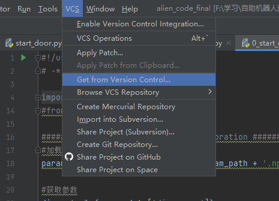

# 南方科技大学 啊对对对队 
2022国际自主机器人大赛代码
## 程序结构
main.py为主程序 

running_parameters.py为复用参数

RobotControl文件夹为机器人动作相关的底层库，应该只需要调用，不需要改动

CameraCalibration文件夹为摄像头矫正相关的库，应该只需要针对一个摄像头校准一次即可

（待校准！！！！）

解决不同关卡的函数应该以py文件的形式保存在level文件夹下，然后在main.py中通过传参的方式进行调用

目前分工思路：每个人分别写几关的解决函数，然后最后在主程序main.py中汇总

吴秋平：过坑，避雷

江乐天：过门，过桥

王柏翰：翻墙，识别杆

张正阳：台阶，踢球

可以复用的函数，如寻找轮廓等函数，应放在levels文件夹下的necessary_functions.py文件中，以供大家调用

请务必多写注释，既方便自己调试，也方便大家阅读

不建议看学长代码中每一关分开写的版本

第一关示例代码已完成，在levels文件夹下的first里，在调整时，请检查原代码是否有对全局变量做写入的操作，如果有写入操作，需要返回写入值然后在main.py中进行修改

online test文件夹为初赛文件夹，应该已经没用了

## GitHub与Pycharm连接教程如下
### 连接

如图所示，这是pycharm的本地project界面

最上方找到VCS，选择Get from Version Control

将图中链接输入，然后选好想要放的位置，然后点击右下方Clone，就可以在pycharm上使用github管理了

### 更新，确认与推送
在右上角，有三个按钮，蓝色的箭头是Update，作用是将当前Github上的项目更新到本地

绿色的勾是Commit，意思是让你确认当前的修改

点击后左侧有如上界面

可以一条一条查看你的修改，并且对在下方对修改做出说明。确认完后按commit确认

绿色的箭头是push，将本地的内容（包括分支）推送到Github上，在推送前要先commit确认

### 多分支功能
因为可能涉及到对main.py的修改，所以这里介绍一下多分支功能

如图，选中上方工具栏Git下的Branches，可以以一个时间点的代码创造属于你自己的代码分支，在这个分支中可以随便对代码做操作也不会影响到Github上的代码

建议分支用自己的名字命名，想要切换分支还是从Branches进去，选择另一个分支的Checkout就可以切换到另一个分支了
